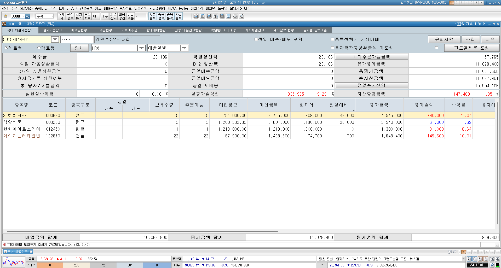

# 2026년 1월 모의투자 결과 보고서

> 한국투자증권 eFriend Plus 모의투자 (김민석 상시대회)

## 1. 요약

| 항목 | 금액 | 비고 |
|------|------|------|
| **매입금액 합계** | 10,068,800원 | 총 투자 원금 |
| **평가금액 합계** | 11,028,400원 | 현재 평가액 |
| **평가손익 합계** | **+959,600원** | 수익금 |
| **실평가손익률** | **+9.29%** | 수익률 |
| **자산증감금액** | +147,400원 | 전일 대비 +1.35% |

## 2. 포트폴리오 상세

| 종목명 | 코드 | 보유수량 | 매입단가 | 매입금액 | 현재가 | 평가금액 | 평가손익 | 수익률 |
|--------|------|---------|---------|---------|-------|---------|---------|-------|
| SK하이닉스 | 000660 | 5주 | 751,000 | 3,755,000 | 909,000 | 4,545,000 | **+790,000** | **+21.04%** |
| 삼양식품 | 003230 | 3주 | 1,200,333 | 3,601,000 | 1,180,000 | 3,540,000 | -61,000 | -1.69% |
| 한화에어로스페이스 | 012450 | 1주 | 1,219,000 | 1,219,000 | 1,300,000 | 1,300,000 | **+81,000** | **+6.64%** |
| 와이지엔터테인먼트 | 122870 | 22주 | 67,900 | 1,493,800 | 74,700 | 1,643,400 | **+149,600** | **+10.01%** |

## 3. 수익 기여도 분석

### 수익 기여 종목 (TOP 3)
1. **SK하이닉스**: +790,000원 (+21.04%) - 반도체 업황 호조
2. **와이지엔터테인먼트**: +149,600원 (+10.01%) - 엔터 섹터 강세
3. **한화에어로스페이스**: +81,000원 (+6.64%) - 방산주 지속 강세

### 손실 종목
- **삼양식품**: -61,000원 (-1.69%) - 단기 조정 구간

## 4. 계좌 현황

| 항목 | 금액 |
|------|------|
| 예수금 | 23,106원 |
| D+2 정산액 | 23,106원 |
| 최대주문가능금액 | 57,765원 |
| 유가평가금액 | 11,028,400원 |
| 총평가금액 | 11,051,506원 |
| 순자산금액 | 11,027,901원 |

## 5. 투자 전략 분석

### 섹터 배분
| 섹터 | 종목 | 비중 |
|------|------|------|
| 반도체 | SK하이닉스 | 약 37% |
| 식품 | 삼양식품 | 약 36% |
| 방산 | 한화에어로스페이스 | 약 12% |
| 엔터 | 와이지엔터테인먼트 | 약 15% |

### 전략 평가
- **장점**: 섹터 분산 투자로 리스크 관리
- **성과 요인**: SK하이닉스의 HBM 수요 호조, 방산주 지정학적 이슈 수혜
- **개선점**: 삼양식품 편입 타이밍 재검토 필요

## 6. 다음 달 계획

- 모의투자 지속하며 실제 매매 전략 검증
- 리포트 분석과 연계하여 투자 판단 근거 기록
- 수익률 목표: 월 5% 이상 유지

---

## 참고

- **플랫폼**: 한국투자증권 eFriend Plus (모의투자)
- **대회명**: 김민석 상시대회
- **계좌번호**: 50159349-01
- **기준일**: 2026년 2월 1일 (토) 오후 11:13

---

*작성일: 2026년 2월 1일*
